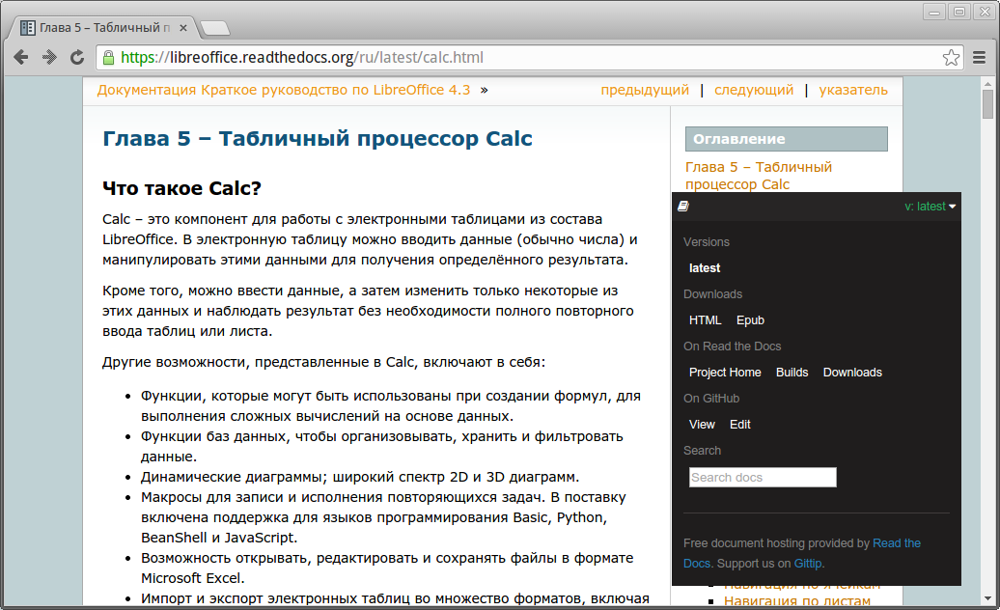

.. meta::
   :description: Краткое руководство по LibreOffice 
   :keywords: LibreOffice, Writer, Impress, Calc, Math, Base, Draw, либреоффис, Предисловие

.. Список автозамен

.. |br| raw:: html

    

Предисловие
===========

Данное руководство является дополненным и исправленным переводом 8 главы официального англоязычного руководства Getting Started 4.2 (http://www.libreoffice.org/get-help/documentation/). Оно является частью *Краткого руководства по LibreOffice 4.3*, перевод которого осуществляется в данный момент (https://libreoffice.readthedocs.org).

По ходу повествования будут встречаться ссылки на некоторые разделы «данного» руководства, имеется ввиду краткое руководство по LibreOffice. Оно находится на стадии перевода/адаптации, готовые главы опубликованы на странице https://libreoffice.readthedocs.org.

Также будут встречаться ссылки на полное руководство по LibreOffice Base. К сожалению, русскоязычного перевода нет и в ближайшее время не планируется. 

Все руководства доступны на английском языке: http://www.libreoffice.org/get-help/documentation/

О полном руководстве по Base
~~~~~~~~~~~~~~~~~~~~~~~~~~~~~~

К сожалению, Base является малофункциональным инструментом, уступающим своему коммерческому аналогу. С другой стороны, работа с базами данных сама по себе достаточно сложна и требует определенных знаний тех или иных баз данных (MySQL, Firebird, Oracle RDBMS и др.). И несмотря на большую функциональность, MS Access ещё не гарантирует грамотное создание баз данных. Он лишь дает ложную иллюзию простоты процесса, что порой приводит к головной боли. Поэтому многие опытные пользователи используют MS Access и Base только для подключения к базам данных, а сами базы создают с помощью иных инструментов.

В связи с этим нами было принято решение в ближайшее время не заниматься переводом полного руководства по LibreOffice Base. Однако, если кто-нибудь пожелает заняться переводом или написанием собственного руководства по Base, мы будем только  рады, окажем посильную помощь и снабдим всеми необходимыми инструкциями.

Read The Docs
-------------

Руководство опубликовано с помощью связки reStructuredText, Python Sphinx, GitHub и сервиса Read the Docs. Подробнее об этом можно прочитать в руководстве по генератору документации Sphinx (http://librerussia.blogspot.ru/2014/12/sphinx.html).

Сервис Read The Docs содержит ряд полезных функций. Обратите внимание на темный прямоугольник в правом нижнем углу — нажмите на него. 

.. figure:: _static/rtd-001.png
    :scale: 30%
    :align: center
    :alt: Меню Read The Docs
    
    Меню Read The Docs

Откроется панель, на которой находятся ссылки для скачивания руководства в различных форматах и другие функции:

    
    Меню Read The Docs

Также обратите внимание на адрес руководства. При копировании ссылки на руководство используйте не весь адрес, а только **http://base.readthedocs.org**.

Перевод руководства на другие языки
-----------------------------------

Сервис Read The Docs позволяет размещать на одном адресе несколько локализаций руководства. В далеком будущем мы планируем разместить англоязычную версию руководства. 

Если есть желающие перевести данное руководство на свои родные языки, то мы с радостью разместим переводы на адресах http://base.readthedocs.org и https://libreoffice.readthedocs.org. За дополнительной информацией и консультацией обращайтесь по адресу, приведенному в разделе `Обратная связь`_.

.. figure:: _static/rtd-003.png
    :scale: 80%
    :align: center
    :alt: Выбор других языков
    
    Выбор других языков

Ошибки и опечатки
-----------------

Объемы информации очень большие, а работает над ними всего два с половиной человека. Если вы нашли ошибку, опечатку или любую другую несостыковку, сообщите нам об этом одним из следующих способов:

* оставьте сообщение на форуме в теме: http://forumooo.ru/index.php/topic,4689.msg29027.html;
* отправьте письмо на личную почту редактору: LibreRussia@gmail.com (пожалуйста, указывайте тему сообщения);
* сделайте исправление и вышлите Pull Request (для знатоков :abbr:`ReST (reStructuredText)` и GitHub).

Авторские права
---------------
Руководство распространяется на условиях лицензии «Attribution-ShareAlike» («Атрибуция — На тех же условиях») 4.0 Всемирная (CC BY-SA 4.0) [#]_.

.. [#] http://creativecommons.org/licenses/by-sa/4.0/deed.ru.

Команда
-------

Над руководством работали:

* Роман Кузнецов (перевод, адаптация, вычитка)
* Дмитрий Мажарцев (адаптация, вёрстка) 

Дата публикации и версия программного обеспечения
-------------------------------------------------

Опубликовано 8 февраля 2015 года. Версия программы LibreOffice 4.3.3.2.

Обратная связь
--------------

|br|

:Редактор: Дмитрий Мажарцев

:Контакты: LibreRussia@gmail.com

:Блог:  http://libreoffice.blogspot.ru

:Адрес: Волгоград

:Дата: 8 февраля 2015 года
